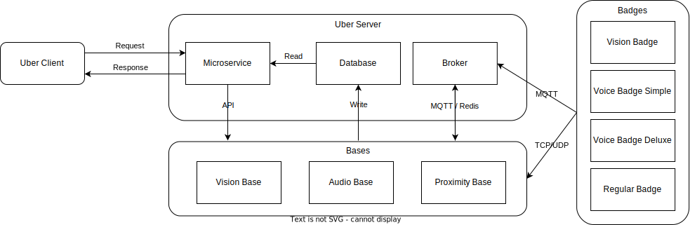

# Mobox System Design

## System Diagram

Below is a diagram that represents the different components of the system and their interactions:

The Mobox system is designed to analyze the collaboration level within a group using different modality data. The system is composed of several modules: User Client, Uber server, Bases and Badges. 

## Uber Client (Frontend)

The Uber-Client is the dashboard of the system. It communicates with the Data Server to send requests and receive results. It also provides a real-time visualization of the conversational characteristics by subscribing to different topics from the corresponding MQTT / Redis broker, and a post-time visualization of the whole session.

| Tech               | Features                          |
| ------------------ | --------------------------------- |
| Web Browser        | Wi-Fi                             |
|                    | Graphing                          |
|                    | MQTT  Client                      |
|                    | Reis Client                       |
|                    | Visualization                     |

## Uber Server (Backend)

The Database Server is responsible for data storage and API endpoints. It receives requests from the uber-client, triggers basestation's service, and sends back results to the user-client.
+ Influx DB stores time series characteristics (e.g. speakers by time, graph links by time).
+ Mongo DB stores text characteristics (e.g. transcription by speaker).
+ MQTT broker stores data received from publisher (MCUs, badges) and sends them to subscriber (bases, uber-client)
+ Redis broker stores data received from publisher (bases) and sends them to subscriber (base, uber-client)
+ Flask server implements different API endpoints that receives request from uber-client and response to it

| Tech      | Features             |
| --------- | -------------------- |
| Linux box | InfluxDB server      |
|           | MongoDB server       |
|           | MQTT broker          |
|           | Redis broker         |
|           | Flask server         |

## Bases

The Bases are responsible for data collection and processing. They include:

### Vision-Base

The Vision-Base is designed to capture April Tags using wide-angle cameras or the Owl Meeting Lab, and does the April-Tag detection.

| Tech         | Features                         |
| ------------ | -------------------------------- |
| Raspberry-Pi | Wi-Fi                            |
| Wide angle camera or OWL meeting | InfluxDB Client|
|              | MQTT Client                      |
|              | Ethernet                         |

### Audio-Base

The Audio-Base processes audio data collected from jabra and badges, and does the speaker reocognition /diarization, calculate the frequency of detected keyword.

| Tech                   | Features           |
| ---------------------- | ------------------ |
| Raspberry-Pi (simple)  | Wi-Fi              |
| Unix Box (deluxe)      | Redis Client       |
| Nvidia Jetson (deluxe) | InfluxDB Client    |
| Jabra                  | MongoDB Client     |
|                        | Ethernet           |

### Proximity-Base

The Proximity-Base tracks location with BLE or RFID and provides proximity information. 

| Tech          | Features           |
| ------------- | ------------------ |
| Raspberry-Pi  | BLE                |
| RFID Reader   | Wi-Fi              |
|               | MQTT Client        |
|               | InfluxDB Client    |
|               | Ethernet           |

## Badges

The Badges are responsible for data collection and processing. They include:

### Vision-Badge

The Vision-Badge uses April Tags and Arduino Nicla Vision board to capture image frame and does the on-board April-Tag detection.

| Tech                 | Features            |
| -------------------- | ------------------- |
| Arduino Nicla Vision | Image processing    |
| April Tag            | Wi-Fi               |
| Battery              | MQTT Client         |

### Voice-Badge Deluxe

The Voice-Badge Deluxe uses Arduino Nicla Vision board to stream audio data to the Voice-Base Deluxe for further audio processing.

| Tech                                      | Features            |
| ----------------------------------------- | ------------------- |
| Arduino Nicla Vision / H7 + VisionShield  | Audio recording     |
| April Tag                                 | Wi-Fi               |
| Battery                                   | TCP/UDP             |

### Voice-Badge Simple

The Voice-Badge Simple uses April Tags and Arduino Nicla Voice to capture audio data and does the on-board keyword detection.

| Tech                               | Features            |
| ---------------------------------- | ------------------- |
| Arduino Nicla Voice                | Audio processing    |
| Battery                            |                     |

### Regular-Badge

The Regular-Badge is a plain badge with an April-Tag and RFID tag.

| Tech      | Features             |
| --------- | -------------------- |
| April-Tag | ID detected by vision-base |
| RFID Tag  | Proximity detection  |

### **Other Devices (Inputs)**

##### *Voice Device | Jabra*

+ Group work VAD and SD

##### *Owl Lab Meeting*

+ 360 Video

+ Audio

